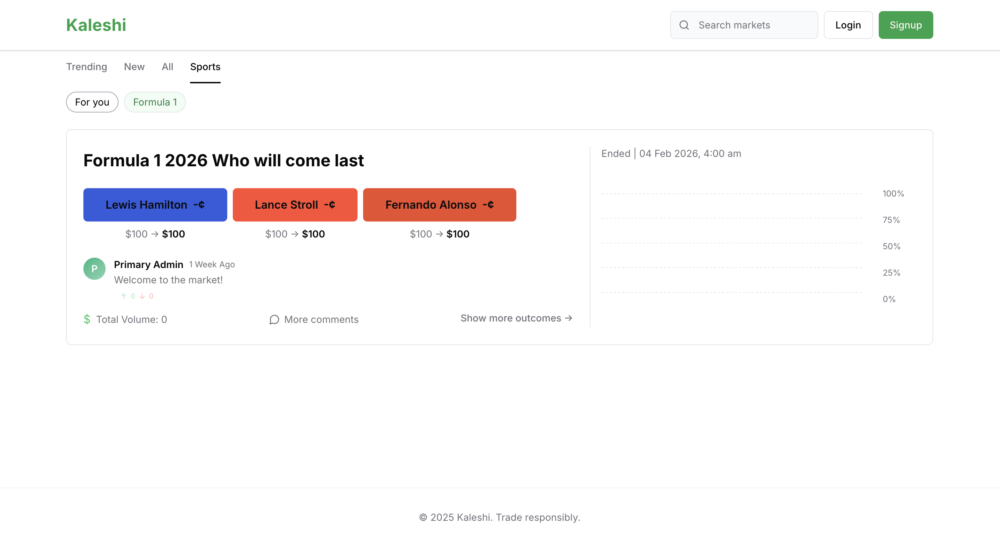
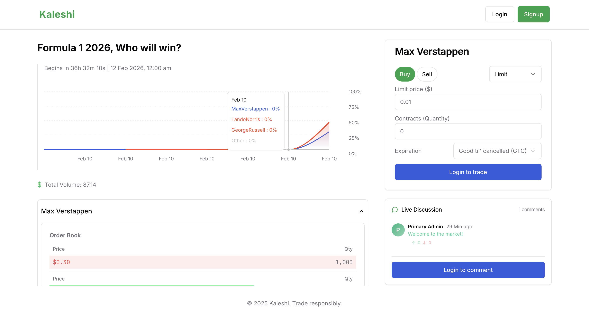

# Kaleshi

> A high-performance, real-time prediction market application inspired by Kalshi.




<!-- Space for more screenshots -->

## Overview

Kaleshi allows users to trade on the outcome of future events, such as sports matches (e.g., Real Madrid vs Barcelona) or economic indicators. It features an orderbook-based trading system where users can bet on event probabilities in real-time.

Designed for high frequency and low latency, Kaleshi processes **1500+ orders per second** with a **p95 latency of 25ms**, ensuring a seamless trading experience even during high-traffic events.

## Key Features

- **Multi-Outcome Markets**: Support for complex events with multiple potential outcomes.
- **Advanced Order Types**:
  - Market Orders
  - Limit Orders
  - Immediate or Cancel (IOC)
  - Good Till Cancelled (GTC)
  - Fill or Kill (FOK)
- **High-Performance Matching Engine**: Built in **Rust**, maintaining in-memory order books with 99.99% uptime and correct matching/rejection semantics.
- **Automated Market Maker (AMM)**: Integrated AMM to bootstrap liquidity and stabilize early market pricing.
- **Real-Time Data**: Live commentary and market updates via WebSockets.
- **Analytics**: Historical order book depth and trade history stored in **TimescaleDB** for replay and analysis.
- **Fault Tolerance**: Event-driven architecture ensures correct order processing and recovery under failure.

## Tech Stack

- **Frontend**: 
  - [TypeScript](https://www.typescriptlang.org/)
  - [React](https://reactjs.org/)
  - [TailwindCSS](https://tailwindcss.com/)
  - [Vite](https://vitejs.dev/)
- **Backend API**: 
  - [Node.js](https://nodejs.org/)
  - [NestJS](https://nestjs.com/)
- **Matching Engine**: 
  - [Rust](https://www.rust-lang.org/)
- **Databases & Infrastructure**:
  - **SQLite**: Core application data.
  - **TimescaleDB**: Time-series data for order books and trade history.
  - **Redis**: Caching, Streams, and Pub/Sub messaging.
  - **Docker**: Containerization.
  - **Turborepo**: Monorepo management.

## Project Structure

This project is a monorepo managed by [Turborepo](https://turbo.build/).

### Apps

- `apps/backend`: NestJS backend API.
- `apps/frontend`: React frontend application.
- `apps/matching-engine`: High-performance Rust matching engine.
- `apps/crons`: Scheduled tasks and background jobs.
- `apps/worker`: Background worker processes.

### Packages

- `packages/db`: Database configurations and schemas.
- `packages/eslint-config`: Shared ESLint configurations.
- `packages/typescript-config`: Shared TypeScript configurations.

## Getting Started

### Prerequisites

- [Node.js](https://nodejs.org/) (>= 18)
- [pnpm](https://pnpm.io/)
- [Rust](https://www.rust-lang.org/) (for the matching engine)
- [Docker](https://www.docker.com/) (for databases)

### Installation

1. Clone the repository:
   ```bash
   git clone https://github.com/chetanguptaa/kaleshi.git
   cd kaleshi
   ```

2. Install dependencies:
   ```bash
   pnpm install
   ```

3. Run the development server:
   ```bash
   turbo run dev
   ```

## Roadmap

### P0 (High Priority)
- [ ] Consistent timing across application and client

### P2 (Medium Priority)
- [ ] Crons Testing

### P3 (Low Priority)
- [ ] Move the account details -> Rust engine

## License

This project is unlicensed.
